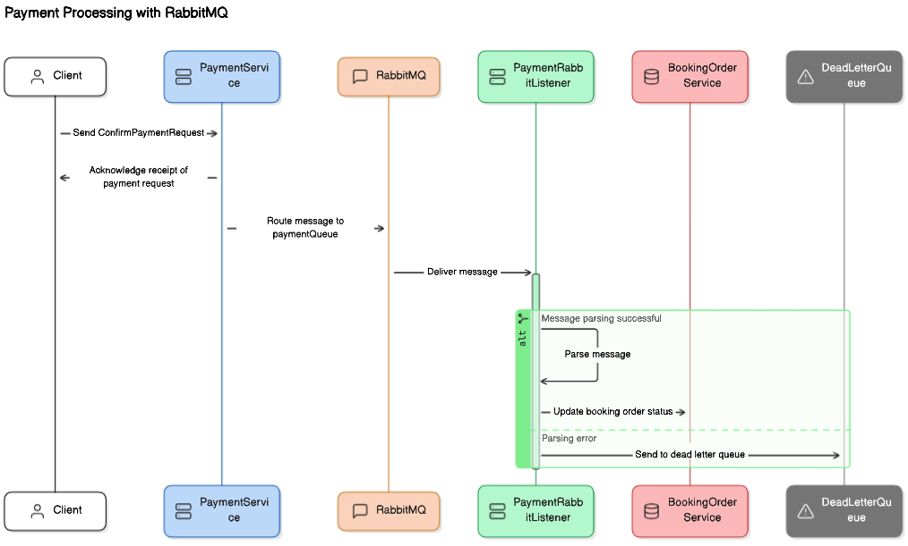

# Property Booking Website
這是一個使用 Java Spring Boot 開發的後端 API 專案，專為房屋短期租賃網站設計。

## 前端線框稿
本專案以該線框稿為基礎發想製作，完整線框稿請參考：https://balsamiq.cloud/s4w2rn1/pb6j6td

## Swagger API 文件
完整 Swagger API 文件請參考：https://liangni.github.io/property-booking-website/

## 使用技術

    

* **Spring Boot** 開發框架
* **PostgreSQL:** 資料庫
* **AWS S3:** 第三方儲存庫
* **Redis:** 快取技術
* **RabbitMQ:** 消息列隊

## 資料庫實體關係圖 （ER-diagram)
以下僅展示部分實體關係圖，完整線框稿請參考：https://github.com/Liangni/property-booking-website/blob/main/readme-materials/ER-diagram.png
### 房源與訂單、預定日期關係

    

## Redis 時序圖
下圖展示首頁房源的快取管理：

    

## RabbitMQ 時序圖
下圖展示第三方金流發送付款確認 API request 後，RabbitMQ 的消息傳遞過程：

